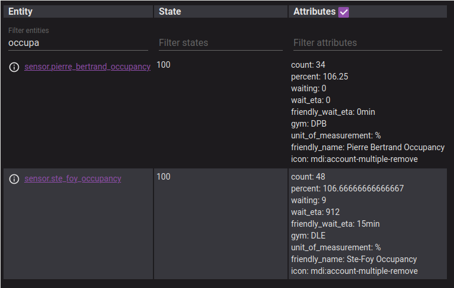
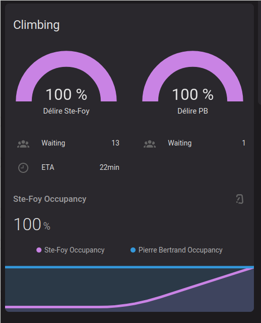

# Délire Escalade Occupancy Sensor

[](https://github.com/sopelj/delire-escalade-hacs-component/releases)
[](LICENSE.md)
[](https://github.com/hacs/integration)


A sensor to display the occupancy of the [Délire Climbing gyms](https://www.delirescalade.com/) in Québec.
A temporary measure in place for Covid. But I check it often enough that this is useful for me. Perhaps you as well.

## Installation

Add to HACS as custom repository:

<https://github.com/sopelj/delire-escalade-hacs-component>

And then add to your configuration.yaml and choose which Gyms you want to add sensors for:

```yaml
sensors:
  - platform: de_occupancy
    gyms:
      - beauport
      - pierrebertrand
      - stefoy
      - parc
```

## Usage

The sensors will fetch the information every 10min from Délire Escalade's webpage.
If the occupancy is higher than 95% then it will also check the waitlist for the amount of people waiting and the ETA.

**Note: The sensors will not update between 7am and 11pm because they are closed and it will always be empty**

Example:



### Lovelace

You can use this data to display information about the places you go most often.
For example I currently have this:

```yaml
# Climbing
type: custom:vertical-stack-in-card
cards:
  - type: grid
    title: 'Climbing'
    icon: mdi:carabiner
    columns: 2
    square: false
    cards:
      - type: custom:vertical-stack-in-card
        cards:
          - type: gauge
            name: Délire Ste-Foy
            entity: sensor.ste_foy_occupancy
          - type: entities
            entities:
              - type: custom:template-entity-row
                icon: mdi:account-group
                name: Waiting
                state: "{{ state_attr('sensor.ste_foy_occupancy', 'waiting') }}"
                condition: "{{ state_attr('sensor.ste_foy_occupancy', 'waiting') > 0 }}"
              - type: custom:template-entity-row
                icon: mdi:clock-time-nine-outline
                name: ETA
                state: "{{ state_attr('sensor.ste_foy_occupancy', 'friendly_wait_eta') }}"
                condition: "{{ state_attr('sensor.ste_foy_occupancy', 'friendly_wait_eta') != None }}"

      - type: custom:vertical-stack-in-card
        cards:
          - type: gauge
            name: Délire PB
            entity: sensor.pierre_bertrand_occupancy
          - type: entities
            entities:
              - type: custom:template-entity-row
                icon: mdi:account-group
                name: Waiting
                state: "{{ state_attr('sensor.pierre_bertrand_occupancy', 'waiting') }}"
                condition: "{{ state_attr('sensor.pierre_bertrand_occupancy', 'waiting') > 0 }}"
              - type: custom:template-entity-row
                icon: mdi:clock-time-nine-outline
                name: ETA
                state: "{{ state_attr('sensor.pierre_bertrand_occupancy', 'friendly_wait_eta') }}"
                condition: "{{ state_attr('sensor.pierre_bertrand_occupancy', 'friendly_wait_eta') != '0min' }}"

  - type: custom:mini-graph-card
    icon: mdi:carabiner
    hours_to_show: 10
    entities:
      - sensor.ste_foy_occupancy
      - sensor.pierre_bertrand_occupancy

```

Which looks like:


